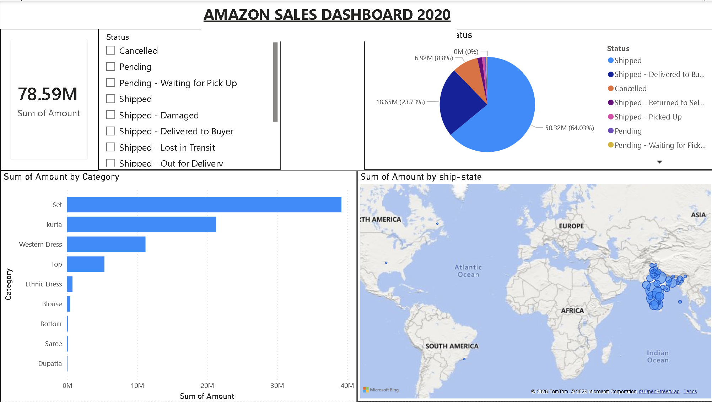

# Amazon Sales Analytics Dashboard

## Overview
Interactive Power BI dashboard built to analyze Amazon sales performance, revenue trends, order status distribution, product category performance, and geographic sales patterns.

## Tools Used
- Power BI
- Excel
- Python
- Pandas

## Key Insights
- Analyzed 121K+ sales records
- Evaluated ₹78.6M in revenue
- Identified top-performing product categories
- Tracked order status distribution
- Visualized sales across geographic regions

## Dashboard Preview

